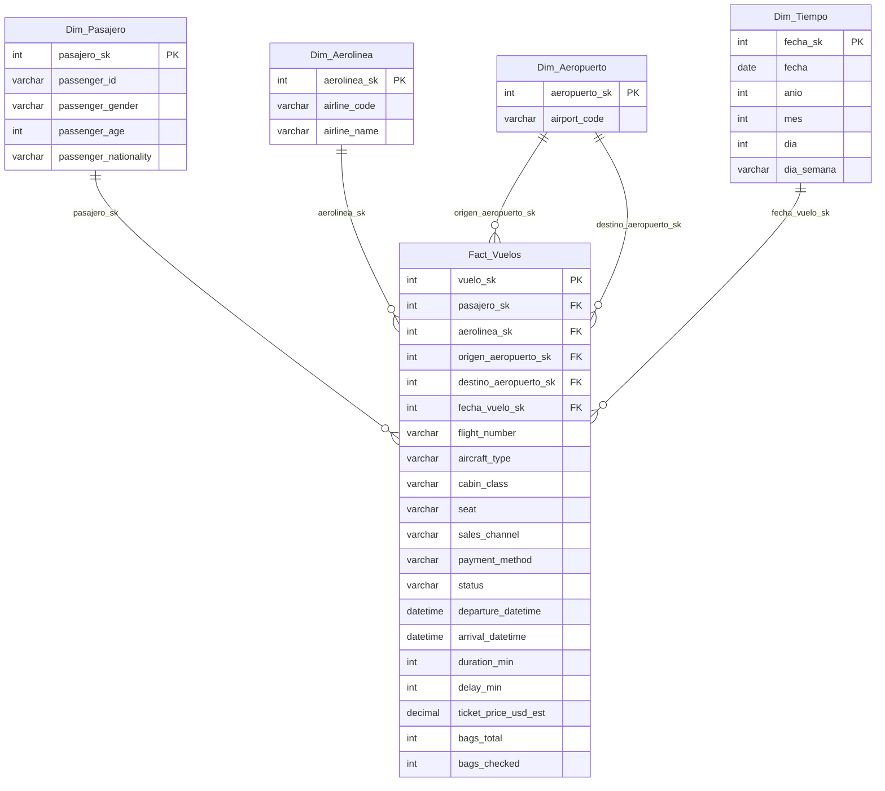

# Práctica 1 - Proceso ETL de Vuelos

**Curso:** Seminario de Sistemas 2  
**Estudiante:** Wilmer Estuardo Vásquez Raxón  
**Carnet:** 201800678

---

## 1. Descripción general

Se implementó un proceso **ETL (Extracción, Transformación y Carga)** en Python para integrar un dataset de vuelos hacia un modelo multidimensional en SQL Server orientado a análisis (BI).

Objetivo cumplido:
- Extraer datos desde archivo CSV.
- Limpiar, homologar y estandarizar datos.
- Cargar información en un modelo dimensional (hechos + dimensiones).
- Ejecutar consultas analíticas para validación y generación de indicadores.

---

## 2. Estructura del proyecto

```text
Practica1/
├── dataset_vuelos_crudo.csv
├── main.py
├── README.MD
└── BD/
      ├── creacion_tablas.sql
      └── consultas_analiticas.sql
```

---

## 3. Requerimientos técnicos

- Python 3.10+
- SQL Server
- Librerías Python:
   - pandas
   - pyodbc

Instalación:

```bash
pip install pandas pyodbc
```

---

## 4. Proceso ETL implementado

### 4.1 Extracción

- Fuente: `dataset_vuelos_crudo.csv`
- Método: lectura con `pandas.read_csv()` desde ruta relativa al script.

### 4.2 Transformación

Transformaciones principales aplicadas:

- Normalización de fechas mixtas:
   - `DD/MM/YYYY HH:MM`
   - `MM-DD-YYYY HH:MM AM/PM`
- Homologación de género (`M`/`F` a `MASCULINO`/`FEMENINO`).
- Estandarización de aeropuertos y códigos en mayúsculas.
- Manejo de nulos y casteo seguro en campos numéricos:
   - `duration_min`, `delay_min`, `bags_total`, `bags_checked`
- Limpieza y normalización de campos de texto.

### 4.3 Carga

La carga es tipo **full refresh**:

1. Limpieza de tablas destino (primero hechos, luego dimensiones).
2. Reinicio de `IDENTITY` para llaves surrogate.
3. Inserción en dimensiones:
    - `Dim_Pasajero`
    - `Dim_Aerolinea`
    - `Dim_Aeropuerto`
    - `Dim_Tiempo`
4. Inserción final en tabla de hechos `Fact_Vuelos` con llaves foráneas.

El script incluye:
- Manejo de excepciones por fila.
- Resumen de filas insertadas/omitidas.
- Impresión de errores detectados (si existen).
- Ejecución automática de consultas analíticas al final.

---

## 5. Diseño del modelo multidimensional

Se implementó un **esquema estrella**:

- **Tabla de hechos:** `Fact_Vuelos`
- **Dimensiones:** `Dim_Pasajero`, `Dim_Aerolinea`, `Dim_Aeropuerto`, `Dim_Tiempo`

### 5.1 Diagrama del modelo



---

## 6. Pasos de ejecución

### 6.1 Crear estructura de base de datos

Ejecutar en SQL Server:

- `BD/creacion_tablas.sql`

### 6.2 Ejecutar ETL

Desde la carpeta `Practica1`:

```bash
python main.py
```

### 6.3 Validar consultas analíticas

- El script `main.py` ejecuta e imprime automáticamente las consultas al finalizar.
- También pueden ejecutarse manualmente con:
   - `BD/consultas_analiticas.sql`

---

## 7. Resultados obtenidos

Ejecución de referencia (salida real):

- Registros extraídos: **10000**
- Vuelos insertados: **10000**
- Filas omitidas: **0**

Indicadores analíticos obtenidos:

- **Total de vuelos:** 10000
- **Top 5 aerolíneas por cantidad de vuelos:**
   1. Copa Airlines (888)
   2. Southwest (868)
   3. Iberia (867)
   4. JetBlue (853)
   5. Ryanair (850)
- **Distribución por género:**
   - MASCULINO: 4912
   - FEMENINO: 4698
   - X: 346
   - NOBINARIO: 44
- **Top 5 destinos:** SAP (701), CUN (699), BCN (696), BOG (696), HAV (693)
- **Estados de vuelo:** ON_TIME (7278), DELAYED (1970), CANCELLED (560), DIVERTED (192)

---

## 8. Archivos entregables

1. **Aplicación ETL en Python:** `main.py`
2. **Script de BD SQL Server:** `BD/creacion_tablas.sql`
3. **Consultas analíticas:** `BD/consultas_analiticas.sql`
4. **Documentación técnica:** `README.MD`

---

## 9. Observaciones técnicas

- Se implementó enfoque dimensional para facilitar consultas agregadas.
- Se aplicó carga completa para mantener consistencia y evitar ruido de ejecuciones previas.
- El proceso está preparado para auditoría básica con conteo de insertadas/omitidas y detalle de errores.