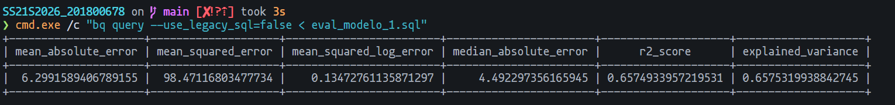
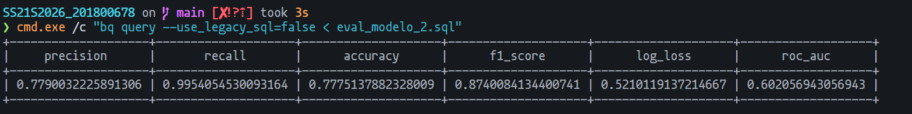
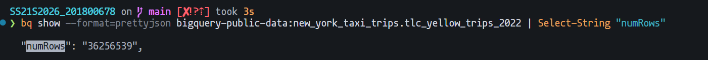

# Proyecto 2: Procesamiento y Análisis Exploratorio de Datos Masivos en BigQuery
**Universidad de San Carlos de Guatemala (USAC)** **Facultad de Ingeniería - Escuela de Ciencias y Sistemas** **Curso:** Seminario de Sistemas 2  
**Estudiante:** Wilmer Estuardo Vasquez Raxon  
**Carnet:** 201800678  

## 1. Dataset Utilizado
Se utilizó el dataset público proporcionado por Google Cloud Platform: `bigquery-public-data.new_york_taxi_trips.tlc_yellow_trips_2022`. Este conjunto de datos contiene la información de los viajes de taxis amarillos en la ciudad de Nueva York. 
* **Volumen inicial analizado:** 36,256,539 registros correspondientes al año 2022.

## 2. Transformaciones y Limpieza de Datos
Para garantizar la integridad temporal del análisis y evitar anomalías, se aplicó un filtro estricto durante la ingesta de datos (`WHERE pickup_datetime BETWEEN '2022-01-01' AND '2022-12-31'`). En la fase de ingeniería de características, se realizaron las siguientes transformaciones:
* **Extracción de componentes temporales:** Uso de `EXTRACT(HOUR)` y `EXTRACT(DAYOFWEEK)` para capturar la variabilidad de la demanda.
* **Casteo de variables:** Conversión de `pickup_location_id`, `dropoff_location_id` y `payment_type` a formato `STRING` para que los modelos los interpreten como categorías puras.

## 3. Técnicas de Optimización Aplicadas
Para reducir costos de procesamiento y mejorar tiempos de respuesta, se creó una tabla derivada (`taxi_trips_2022_optimized`):
* **Particionamiento:** Se particionó por día utilizando la columna `DATE(pickup_datetime)`, evitando el Full Table Scan al consultar fechas específicas.
* **Clustering:** Se agrupó por `pickup_location_id` y `dropoff_location_id` para ubicar rápidamente los bloques de datos geográficos.

### Comparación de Desempeño (Optimizado vs Estándar)
Al realizar una prueba de lectura mediante `--dry_run` para un día específico (`2022-01-15`):
* **Consulta en tabla original:** [INSERTAR LOS BYTES DEL DRY RUN ORIGINAL] procesados.
* **Consulta en tabla optimizada:** [INSERTAR LOS BYTES DEL DRY RUN OPTIMIZADO] procesados.
* *Conclusión:* La optimización demostró una reducción drástica en el escaneo de datos. *(Evidencias adjuntas en la carpeta `/evidencias`)*.

## 4. Modelos de Machine Learning (BigQuery ML)
Para prevenir el *Data Leakage*, ambos modelos implementaron un split temporal determinístico (`data_split_method='CUSTOM'`), entrenando con meses 9 y 10, y evaluando con el mes 11.

### Modelo 1: Regresión Lineal (Predicción de Tarifa)
* **Objetivo:** Predecir el costo total del viaje (`total_amount`).
* **Métricas:**
  * **R2 Score:** 0.657. Explica el 65.7% de la varianza del costo.
  * **Mean Squared Error (MSE):** 98.47.
  * **Mean Absolute Error (MAE):** 6.29 (~$6.30 dólares de margen de error promedio).


### Modelo 2: Regresión Logística (Clasificación de Método de Pago)
* **Objetivo:** Predecir si el pago será con tarjeta de crédito (`payment_type = 1`).
* **Métricas:**
  * **Accuracy:** 0.777.
  * **Recall:** 0.995. Altísima sensibilidad; casi no genera falsos negativos para pagos con tarjeta.
  * **Precision:** 0.779.
  * **ROC AUC:** 0.602.


## 5. Hallazgos Relevantes (Análisis Exploratorio)
* Existen picos significativos de demanda según la hora del día, lo que convierte a la variable temporal en un predictor crucial del comportamiento del tráfico y costo.
* El modelo logístico evidencia una fuerte tendencia estructural hacia un método de pago predominante basado en distancias y zonas de recolección.

## 6. Enlace al Informe Visual
El tablero exploratorio y la comparativa de predicciones (Rolling Forecast) se encuentran en Looker Studio:
* [**[LOOKER_STUDIO]**](https://datastudio.google.com/reporting/eecae227-d412-4429-9efb-a8323f0df72c)

---

## 7. Bitácora de Comandos de Ejecución (PowerShell)

Para la reproducción de este proyecto, se utilizaron los siguientes comandos en el orden indicado:

1. **Configuración de la consulta de creación:**
   `Set-Content -Path "create_table.sql" -Value @' ... '@`

2. **Ejecución de la creación de tabla optimizada:**
   `cmd.exe /c "bq query --use_legacy_sql=false < create_table.sql"`

3. **Entrenamiento del Modelo de Regresión (Tarifas):**
   `cmd.exe /c "bq query --use_legacy_sql=false < modelo_1_regresion.sql"`

4. **Evaluación del Modelo 1:**
   `cmd.exe /c "bq query --use_legacy_sql=false < eval_modelo_1.sql"`

5. **Entrenamiento del Modelo de Clasificación (Pagos):**
   `cmd.exe /c "bq query --use_legacy_sql=false < modelo_2_clasificacion.sql"`

6. **Evaluación del Modelo 2:**
   `cmd.exe /c "bq query --use_legacy_sql=false < eval_modelo_2.sql"`

7. **Creación de Vistas para Dashboard:**
   `cmd.exe /c "bq query --use_legacy_sql=false < vista_exploratoria.sql"`
   `cmd.exe /c "bq query --use_legacy_sql=false < vista_predicciones.sql"`


**Paso 1: Validación de Metadata Original**
Se validó el conteo de la tabla pública sin consumir recursos de procesamiento:
```powershell
bq show --format=prettyjson bigquery-public-data:new_york_taxi_trips.tlc_yellow_trips_2022 | Select-String "numRows"
