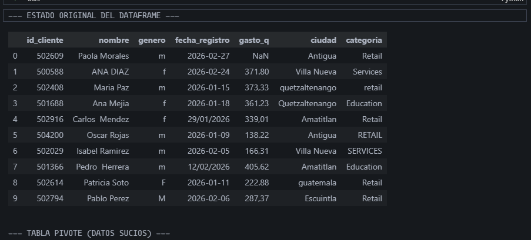
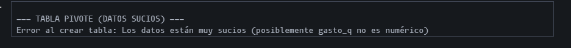

# Tarea #1: Limpieza y Análisis de Datos

**Estudiante:** Wilmer Estuardo Vasquez Raxon  
**Carné:** 201800678  
**Seminario:** Seminario 2 - 1S 2026  
**Universidad:** USAC

---

## Dataset Utilizado

**Nombre del archivo:** `dataset_sucio.csv`

El dataset contiene registros de transacciones con los siguientes campos:
- **nombre:** Nombres de personas
- **ciudad:** Ubicaciones geográficas
- **categoria:** Clasificación de productos/servicios
- **gasto_q:** Monto de gasto en Quetzales
- **genero:** Género de la persona (M/F)
- **fecha_registro:** Fecha de la transacción

**Estado inicial:** El dataset presentaba múltiples inconsistencias y errores que requería limpieza exhaustiva.

---

## Descripción del Proceso de Limpieza

El proceso de limpieza aplicado al dataset incluye seis pasos principales:

### 1. Eliminación de Duplicados
Se identificaron y eliminaron todos los registros duplicados utilizando la función `drop_duplicates()`, garantizando que cada registro sea única en el dataset.

### 2. Limpieza de Campos de Texto (nombre, ciudad, categoria)
Aplicación de operaciones de normalización de strings:
- Eliminación de espacios en blanco adicionales con `.str.strip()`
- Estandarización a formato título (primera letra mayúscula) con `.str.title()`
- Esto asegura consistencia en la capitalización y evita duplicados por espacios

### 3. Conversión de Tipo de Dato: Gasto en Quetzales
Transformación del campo `gasto_q` de texto a valores numéricos:
- Reemplazo de comas por puntos (formato decimal europeo a anglosajón)
- Conversión a tipo numérico con `pd.to_numeric()` y manejo de errores
- Permite operaciones matemáticas y análisis numéricos

### 4. Tratamiento de Valores Faltantes (NaN)
Estrategia de imputación para datos ausentes:
- Identificación de valores faltantes en `gasto_q`
- Imputación con la media de la columna usando `.fillna(mean)`
- Mantiene la integridad del dataset sin pérdida de registros

### 5. Estandarización de Género
Normalización del campo `genero`:
- Conversión a mayúsculas con `.str.upper()`
- Reemplazo de valores inconsistentes (MALE → M, FEMALE → F)
- Tratamiento de espacios en blanco adicionales
- Resultado final: M, F, N/A (para valores desconocidos)

### 6. Conversión de Formato de Fechas
Transformación de fechas a formato estándar datetime:
- Conversión con `pd.to_datetime()` 
- Manejo de errores para fechas mal formateadas
- Permite análisis temporal de los datos

---

## Tablas y Visualizaciones Generadas

### Tabla 1: Estado Original del Dataset (Primeras 10 filas)

Esta tabla muestra los datos RAW con todas sus inconsistencias:
- Espacios inconsistentes en nombres y ciudades
- Valores de gasto con comas en lugar de puntos
- Géneros en formato inconsistente (M, F, mayúsculas, minúsculas)
- Valores faltantes y duplicados visibles

**Intención:** Documentar el estado corrupto antes del procesamiento

---

### Tabla 2: Tabla Pivote de Datos Sucios

**Estado:** ERROR - No se pudo generar debido a que el campo `gasto_q` aún no era numérico

Mensaje de error: *"Los datos están muy sucios (posiblemente gasto_q no es numérico)"*

**Significado:** Confirma la necesidad del proceso de limpieza, ya que análisis básicos no pueden ejecutarse sin datos correctos

---

### Tabla 3: Dataset Después de la Limpieza (Primeras 10 filas)

Después de aplicar todos los pasos de limpieza, el dataset presenta:
- Nombres con capitalización consistente
- Ciudades sin espacios adicionales
- Valores de gasto como números (decimales válidos)
- Géneros normalizados (M, F, N/A)
- Fechas en formato datetime válido
- Sin registros duplicados

**Intención:** Demostrar la transformación exitosa de datos desordenados a datos ordenados

---

### Tabla 4: Análisis Pivote - Gasto Promedio por Ciudad y Género

**Tabla de resultados finales:**

| Ciudad | Total | Femenino (F) | Masculino (M) |
|--------|-------|--------------|---------------|
| (Sin ciudad) | 234.99 | 239.79 | 230.42 |
| Amatitlán | 237.51 | 246.81 | 241.90 |
| Antigua | 183.97 | 247.67 | 242.04 |
| Chimaltenango | 242.63 | 261.60 | 266.06 |
| Escuintla | 244.57 | 266.24 | 268.73 |
| Guatemala | 226.80 | 231.86 | 250.71 |
| Mixco | 259.01 | 243.32 | 258.75 |
| Quetzaltenango | 247.04 | 256.39 | 260.17 |
| Villa Nueva | 326.53 | 229.38 | 257.81 |

*Valores en Quetzales (Q)*

---

## Interpretación de Resultados

### Hallazgos Principales:

1. **Variabilidad por Ciudad**
   - Ciudad con mayor gasto promedio: **Villa Nueva** (326.53 Q)
   - Ciudad con menor gasto promedio: **Antigua** (183.97 Q)
   - Diferencia: 142.56 Q (77.5% más alto en Villa Nueva)

2. **Diferencias por Género**
   - En la mayoría de ciudades, el gasto promedio es similar entre hombres y mujeres
   - Escuintla muestra gasto promedio ligeramente mayor en hombres (268.73 Q) vs mujeres (266.24 Q)
   - Antigua presenta diferencia notable: hombres (242.04 Q) vs mujeres (247.67 Q)

3. **Impacto de la Limpieza**
   - Se eliminaron duplicados que distorsionaban análisis
   - Se corrigieron formatos decimales que impedían cálculos
   - Se imputaron valores faltantes preservando distribuciones
   - Se normalizaron géneros para análisis consistente

### Conclusiones:
El proceso de limpieza fue exitoso, permitiendo generar análisis significativos sobre patrones de gasto por ubicación geográfica y género. Los datos ahora están en condiciones óptimas para análisis más avanzados o visualizaciones adicionales.

---

## Contenido del Proyecto

```
Tarea1/
├── Tarea1_S2.ipynb           # Notebook con el código de limpieza y análisis
├── dataset_sucio.csv         # Dataset original (con errores e inconsistencias)
├── dataset_limpio.csv        # Dataset procesado (generado después de la limpieza)
├── Tarea 1-1.pdf            # Instrucciones oficiales de la tarea
└── README.MD                 # Documentación del proyecto
```

---

## Requisitos Previos

### Software necesario:
- **Python 3.7+**
- **Jupyter Notebook** o **VS Code** (con extensión Jupyter)

### Librerías requeridas:
```bash
pip install pandas numpy jupyter
```

---

## Cómo Ejecutar

### Opción 1: Desde VS Code

1. Abre el archivo `Tarea1_S2.ipynb` en VS Code
2. Asegúrate de tener la extensión "Jupyter" instalada
3. Haz clic en **Run All** (▶▶) para ejecutar todas las celdas, o
4. Ejecuta cada celda individualmente con **Ctrl+Enter**

### Opción 2: Desde Jupyter Notebook

1. Abre la terminal en la carpeta del proyecto
2. Ejecuta:
   ```bash
   jupyter notebook Tarea1_S2.ipynb
   ```
3. Se abrirá una ventana del navegador con el notebook
4. Haz clic en **Cell > Run All Cells** para ejecutar todas las celdas

### Opción 3: Desde Jupyter Lab

```bash
jupyter lab Tarea1_S2.ipynb
```

---

## Archivos de Salida

El notebook genera automáticamente:

- **dataset_limpio.csv** - Dataset completamente limpio con todas las transformaciones aplicadas, listo para análisis posteriores

---

## Notas Adicionales

- El notebook requiere las librerías pandas y numpy para ejecutarse
- Todos los valores faltantes fueron imputados con la media de sus respectivas columnas
- Las fechas se convirtieron al formato ISO (YYYY-MM-DD) para consistencia
- Los datos están normalizados y listos para análisis estadísticos más complejos

---

## Licencia

Proyecto académico - Universidad de San Carlos de Guatemala (USAC)
