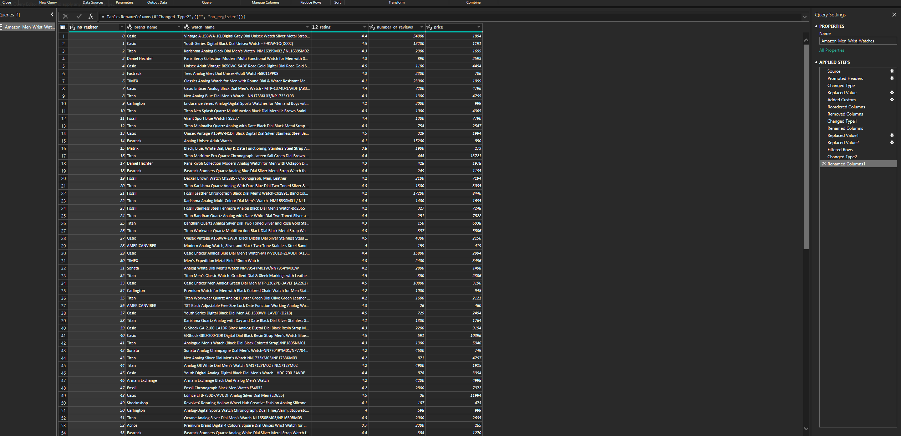
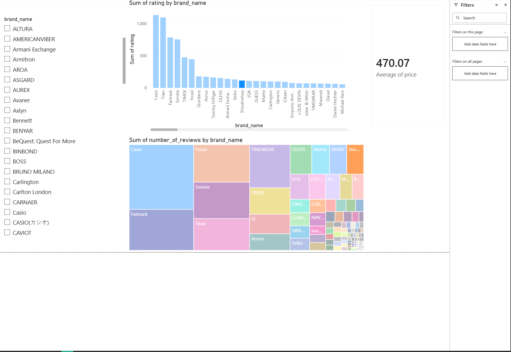

# Informe Analítico y Descripción del Proyecto: Relojes para Hombre en Amazon

**Curso:** Seminario de Sistemas 2 - USAC (1S 2026)  
**Actividad:** Tarea #2 - Dashboard Analítico en Power BI

## 1. Descripción del Dataset

Este proyecto utiliza un dataset obtenido de **Kaggle** que recopila información detallada sobre 2,400 modelos de relojes para caballero en la plataforma Amazon. Los datos incluyen la marca, nombre del modelo, calificación de usuarios (rating), número de reseñas y precio de venta.

## 2. Transformaciones de Datos (Power Query)

Para garantizar la validez y confiabilidad de la información (Objetivo SMART), se realizaron las siguientes transformaciones en Power Query:

- **Limpieza de Precios:** Se eliminaron caracteres no numéricos y se ajustó el formato a número decimal para permitir cálculos de promedio.
- **Normalización de Reseñas:** Se implementó una lógica condicional en lenguaje M para convertir sufijos "K" en valores numéricos (ej. 1.1K a 1100), asegurando la integridad de la magnitud de los datos.
- **Tratamiento de Nulos:** Se filtraron los registros con valores nulos en `rating` y `reviews` para evitar sesgos en el análisis de satisfacción.

## 3. Interpretación de KPIs y Visualizaciones

El dashboard en Power BI integra tablas y gráficas que permiten identificar patrones relevantes. A continuación, se destacan los principales hallazgos estratégicos obtenidos a partir del análisis de los indicadores clave (KPIs):

* **Satisfacción General (Rating 4.10):** El mercado de relojes para hombre en Amazon mantiene un estándar de calidad alto, con una calificación promedio superior a 4 estrellas.
* **Posicionamiento de Precio (3.03K):** El precio promedio de los productos analizados se sitúa en 3,030 unidades monetarias, lo que ayuda a identificar el segmento de mercado dominante.
* **Volumen de Mercado (1M Reseñas):** La acumulación de un millón de reseñas refleja una alta interacción de los consumidores y una base de datos robusta para la toma de decisiones.
* **Dominio de Marca:** El gráfico comparativo y el Treemap revelan que marcas como **Casio** y **Titan** no solo poseen el mayor volumen de reseñas (popularidad), sino que mantienen ratings competitivos frente a marcas de nicho.

## 4. Captura del Dashboard

## 5. Conclusiones

El análisis revela un mercado equilibrado donde la calidad (rating) y la popularidad (reseñas) se concentran en pocas marcas líderes, lo que puede orientar estrategias de posicionamiento y diferenciación para nuevos competidores. Asimismo, los precios promedio indican un nicho de consumo medio, útil para planes de marketing y fijación de precios.

---
**Estudiante:** Wilmer Estuardo Vasquez Raxon  
**Carnet:** 201800678  
**Repositorio:** SS21S2026_201800678 / Tarea2